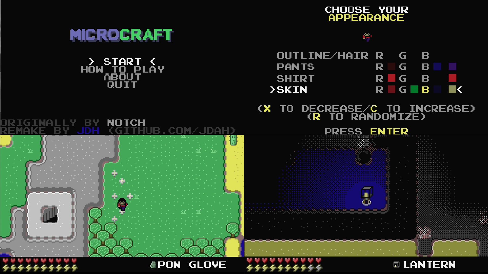

# MICROCRAFT
A Minicraft remake with some neat extras. Beat the fearsome **AIR WIZARD** to win the game!

Some of the neat extras:
- Mithril (new material)
- Iron/Gold/Mithril armor
- Fancy lighting system
- Skeleton archers
- Blue and red slimes
- Cool new air wizard powers
- Character customization
- and much more...

## Running
See [Releases](https://github.com/jdah/microcraft/releases)

See below to build and run for yourself or try to run it out of any decent Java IDE.

*Please note* that in order to run the .jar file directly you will need at least the Java 14 runtime installed. 

## Building
- Mac: `$ ./package.sh` creates `Microcraft-1.0.dmg` which contains the application MICROCRAFT.app.
- Windows: `package.bat` creates `MICROCRAFT-1.0.exe` file which installs MICROCRAFT.exe to `C:\Program Files\MICROCRAFT`.
- With any OS and a valid JDK 14+ install, both `package.{sh, bat}` create `out\artifacts\Microcraft_jar\Microcraft.jar` which can be run on its own with `java -jar out\artifacts\Microcraft_jar\Microcraft.jar`
